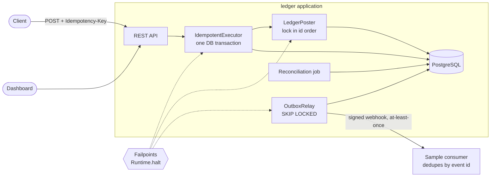

# Ledger

A double-entry payment ledger on Spring Boot 4 and PostgreSQL 16, built around one claim: kill the application at any instant of a transfer, restart it, retry the request, and the money still balances, the transfer happened exactly once and the books reconcile. The claim is tested by starting the real jar as a separate OS process, arming a named failpoint that calls `Runtime.halt()`, and checking the database afterwards. Idempotency keys, a transactional outbox with signed webhooks, and a reconciliation job make the guarantee hold up end to end.

[](https://github.com/mgeladzerezo/ledger/actions/workflows/ci.yml)

## Architecture



Inside one database transaction `IdempotentExecutor` inserts the idempotency key, `LedgerPoster` writes the journal transaction, entries, balance updates and the outbox event, and the stored response is written back to the key row. All of it commits together or not at all.

## Quick start

```
docker compose up --build
```

Open <http://localhost:8206>. The compose file starts PostgreSQL, the application with the demo flag (seed accounts and a background traffic generator) and the sample webhook consumer, so the dashboard is alive immediately.

Things to try:

- **Transfer**: send a transfer, press Send again and see the replay (`Idempotent-Replayed: true`, nothing moves twice). Change the amount without a new key to get the 422.
- **Journal**: open a transaction, see its entries, reverse it.
- **Outbox**: watch deliveries reach the sample consumer and the consumer's duplicate counter.
- **Reconciliation**: run a report on demand.
- **Chaos**: arm `before-commit`, wait for the traffic generator to hit it. The container dies and Docker restarts it; reconcile afterwards and it is clean.

The API is documented in [openapi.yaml](src/main/resources/static/openapi.yaml) (served at `/openapi.yaml`). Compose uses the API key `demo-api-key`; it is only handed to the dashboard when `ledger.demo.enabled=true`.

Run the tests (Docker is required for Testcontainers):

```
./mvnw -B verify          # unit, integration and the crash matrix
./mvnw -B verify -Psoak   # randomised kill-under-load soak instead of the normal suite
```

## How it works

### 1. Money never half-moves

- **Three layers of "debits equal credits".** The domain model ([`Posting`](src/main/java/io/github/mgeladzerezo/ledger/domain/Posting.java)) refuses an unbalanced posting; a deferred constraint trigger in [V1__ledger_core.sql](src/main/resources/db/migration/V1__ledger_core.sql) re-checks every transaction at commit, per currency; the reconciliation job checks again later, which also catches anyone who bypasses the triggers.
- **Entries are append-only.** Triggers reject UPDATE, DELETE and TRUNCATE on journal tables. A correction is a new reversing transaction linked to the original.
- **Materialised balances** live in `account_balances` and change in the same transaction as the entries. They can be recomputed from the entries (`POST /accounts/{id}/rebuild-balance`), and reconciliation compares the two.
- **Plain JDBC, not JPA, on the money path.** The correctness argument is about which row is locked, in which order, and what SQL runs before commit. An ORM hides exactly those decisions behind a persistence context and flush ordering. `JdbcClient` keeps the SQL, the locks and the transaction boundary visible in [`LedgerPoster`](src/main/java/io/github/mgeladzerezo/ledger/core/LedgerPoster.java).
- **Lock ordering.** Balance rows of all accounts in a posting are locked with `SELECT ... ORDER BY account_id FOR UPDATE`, so two transfers between the same accounts in opposite directions queue instead of each holding one lock and waiting for the other. `ConcurrencyTest` proves that PostgreSQL's deadlock counter stays unchanged under maximum contention, and includes a control that locks in inconsistent order and does deadlock, so the test would notice if the ordering stopped mattering.
- **Overdraft checks under concurrency.** The balance is read only after the row lock is taken and the lock is held until commit, so two withdrawals from one account run one after the other and the second sees the first. A `CHECK` constraint on the balance row would reject a wrong commit anyway.

### 2. Idempotency that survives a crash

Details in [`IdempotentExecutor`](src/main/java/io/github/mgeladzerezo/ledger/idempotency/IdempotentExecutor.java).

- The key row is inserted first in the same transaction as the ledger entries and carries the response when the transaction ends. After a crash there are only two durable states: nothing, or everything. "Money moved but the key is unknown" is not reachable.
- Same key and same body returns the stored status and body. Same key and a different body is 422. Keys are scoped to the API key and expire after `ledger.idempotency.retention` (24 h).
- **A concurrent duplicate waits.** It blocks on the key insert inside PostgreSQL and gets the original's response when that commits, so the client does not need a retry loop. The wait is capped (`wait-timeout`, 5 s); beyond that it gets 409 with `Retry-After`, so a stuck original cannot pin request threads forever. Rejected business requests (insufficient funds) are stored and replayed; transient failures (lock timeout, lost connection) roll back the key and run again on retry.

### 3. Transactional outbox, at-least-once

- Each posting writes an `outbox_events` row and one delivery per active subscription in the posting's transaction.
- [`OutboxRelay`](src/main/java/io/github/mgeladzerezo/ledger/outbox/OutboxRelay.java) claims due deliveries with `FOR UPDATE SKIP LOCKED`, sends them as webhooks with an HMAC-SHA256 signature, and records SENT, a retry with exponential backoff, or DEAD after `max-attempts`. Several relay instances are safe: a claimed row is locked and others skip it.
- A crash between send and mark rolls the claim back and the event is sent again. The [sample consumer](src/main/java/io/github/mgeladzerezo/ledger/consumer/SampleConsumer.java) verifies the signature and deduplicates by event id in its own tables.
- **Ordering.** Events carry a monotonically increasing `sequence`. Deliveries within a batch are sent concurrently, and retries reorder, so the relay does not guarantee delivery order. A consumer that needs order must apply by `sequence` and tolerate gaps and duplicates. The ledger's own balances do not depend on it, because each event carries per-account deltas keyed by event id.

### 4. Reconciliation

[`ReconciliationService`](src/main/java/io/github/mgeladzerezo/ledger/reconciliation/ReconciliationService.java) runs on a schedule and on demand (`POST /api/v1/reconciliation/runs`). Checks: debits equal credits globally and per transaction, every transaction has entries, no orphan entries, every materialised balance equals its entries, held amounts match active holds, holds fit within balances, every transaction has an outbox event, every committed idempotency key has a response. Reports are stored with a severity per finding and shown in the dashboard. Trial balance and daily statements are under `/api/v1/reports` and `/api/v1/accounts/{id}/statement`.

## Failure scenarios

| Failure scenario | State the system is left in | Why it is safe | Test that proves it |
|---|---|---|---|
| Process dies after the idempotency key insert, after the debit entry, after both entries, after the balance update, after the outbox insert, or just before COMMIT | Nothing committed. No key, no transaction, balances unchanged | One transaction; PostgreSQL discards it when the connection drops. The retry with the same key executes once | `FailpointCrashIT` (one case per failpoint) |
| Process dies after COMMIT, before the HTTP response | Transfer, outbox event and stored response all committed; client got nothing | The key and its response committed with the money. The retry replays the stored 201 and moves nothing | `FailpointCrashIT` (`after-commit-before-response`) |
| Process dies in the relay before sending | Deliveries still PENDING, locks gone with the connection | The next relay claims them again | `FailpointCrashIT` (`relay-before-send`) |
| Process dies in the relay after the subscriber answered, before the mark committed | Delivery PENDING although the subscriber has the event | Redelivery is expected; the consumer discards the duplicate by event id | `FailpointCrashIT` (`relay-after-send-before-mark`, `relay-after-mark-before-commit`) |
| Random kills while many clients transfer concurrently | Some in-flight requests lost, clients retry with the same keys | Every acknowledged transfer exists exactly once, totals unchanged, consumer projection equals the ledger, reconciliation clean | `CrashSoakIT` (`-Psoak`) |
| Two requests with the same key at once | One transfer | Key insert serialises them; the second waits and replays | `IdempotencyTest` (32 threads, one key) |
| Opposite-direction transfers, hot accounts | No deadlock error reaches callers | Locks taken in account id order | `ConcurrencyTest` |
| Two withdrawals race for the last funds | One succeeds, one gets 422 | Check after row lock, plus CHECK constraint | `ConcurrencyTest` |
| A balance row is edited directly in SQL | Balance disagrees with entries | Reconciliation reports it; `rebuild-balance` repairs it | `ReconciliationTest` |
| Unbalanced transaction written past the application | Rejected at commit by the trigger; if the trigger is disabled, reconciliation catches it | Three independent layers | `SchemaConstraintsTest`, `ReconciliationTest` |
| Webhook endpoint down or erroring | Delivery retried with exponential backoff, then DEAD | Bounded retries, DEAD rows visible and re-queueable | `OutboxRelayTest`, `BackoffPolicyTest` |
| Several relay instances | Each delivery is sent by one | `FOR UPDATE SKIP LOCKED` | `OutboxRelayTest` (six competing relays) |

## Design decisions

- **Waiting duplicates instead of 409 first.** Returning 409 immediately pushes a retry loop onto every client. Waiting inside PostgreSQL costs one connection per waiting duplicate, bounded by the wait timeout, and gives the client the real answer. 409 with `Retry-After` is the fallback.
- **Holding the relay's transaction across HTTP calls.** It occupies one pooled connection for at most one HTTP timeout per cycle and removes the lease column, lease expiry and clock comparison. A lease table would scale to slower subscribers; this is simpler to get right.
- **Failpoints in production code.** They are real code paths (`Failpoints.hit`) so the test kills the exact binary that ships. Arming over HTTP exists only with `ledger.chaos.enabled=true` and answers 403 otherwise; arming from configuration is also possible.
- **No JPA, no Spring Security.** Plain JDBC for the money path (above). A fixed set of API keys, compared in constant time, authenticates `/api/**`; the key also scopes idempotency keys.
- **Hand-written OpenAPI** instead of springdoc: no dependency on Boot 4 compatibility, at the price that it can drift from the controllers. It is not generated or checked against them.
- **Integer minor units everywhere.** The Jackson configuration rejects `1.5` and `"5"` for an amount.

## Testing

| Class | What it proves |
|---|---|
| `PostingTest` | The domain model rejects unbalanced, mixed-currency and malformed postings |
| `SchemaConstraintsTest` | The database refuses unbalanced commits, UPDATE, DELETE and TRUNCATE on journal tables, using raw SQL |
| `LedgerApiTest` | Every operation over real HTTP: accounts, deposits, withdrawals, transfers, holds, reversals, FX, multi-leg, problem documents, cursor pagination, auth |
| `IdempotencyTest` | Replay, 422 on body mismatch, 32 threads on one key give one transfer, stored rejections, 409 with `Retry-After`, nothing stored on transient failure, expiry, key scoping |
| `ConcurrencyTest` | Random transfers under maximum contention conserve money with PostgreSQL's deadlock counter unchanged; a control proves unordered locking deadlocks; no overdraft, double capture or double reversal under races |
| `OutboxRelayTest` | Signed delivery, backoff, dead letters, six competing relays, consumer deduplication |
| `ReconciliationTest` | Each check catches the corruption it exists for, including a balance row corrupted with direct SQL; clean while transfers are in flight |
| `FailpointsTest`, `BackoffPolicyTest`, `WebhookSignatureTest` | Failpoint registry, backoff arithmetic, HMAC signing |
| `FailpointCrashIT` | For every failpoint: separate OS process, failpoint armed, transfer sent, process exit status 137 asserted, database inspected, restart, retry with the same key, exactly once, money conserved, consumer applied once, reconciliation clean. Also arms a failpoint purely from start-up configuration |
| `CrashSoakIT` (`-Psoak`) | Concurrent random transfers with `destroyForcibly()` at random moments, then conservation, exactly-once, consumer projection and reconciliation |

Reading the crash test critically: each case asserts that the process actually exited with `Failpoints.EXIT_CODE` (137) before anything else is checked, and the pre-commit cases additionally assert that the client got no response and the database holds no trace of the key. A test that passed without the process dying would fail on that assertion.

Results below were observed earlier, by running the suite once on a Windows 10 machine with 16 logical CPUs and 16 GB shared with other builds (timings are noisy). They cover the code at the commit "test: own and close HTTP clients, keep temp files under target/" and are not a claim about anything changed afterwards. Reproduce with the commands in Quick start.

- First full `mvn verify`: 87 unit and integration tests plus 11 crash cases passed (`ConcurrencyTest` 44 s, `FailpointCrashIT` 67 s).
- One `mvn verify -Psoak` run, random seed: 8 kills, 12 client threads, 1513 transfers acknowledged, 10 rejected for insufficient funds, about 10 300 client retries after failures, 55 duplicate deliveries discarded by the consumer, 92 s. Money conserved, reconciliation clean.
- A second full `mvn verify`, run later while the machine was heavily loaded by other builds, failed three tests: `ConcurrencyTest` (two tests, client HTTP requests timed out after 30 s; the class took 295 s instead of 44 s) and `OutboxRelayTest.failedDeliveryIsRetriedWithBackoffUntilItSucceeds` (the "retry is scheduled in the future" assertion). Both look like wall-clock sensitivity under load, not logic errors, but that was not confirmed: the re-run was cancelled. Treat both tests as potentially flaky on a loaded machine.

Throughput and latency: not measured.

## Known limitations

- **Verification status.** The full test suite (including the crash matrix) last ran green at the commit named under Testing. Everything after that was only compiled, not executed: the dashboard (`src/main/resources/static`), `openapi.yaml`, the README, `.github/workflows/ci.yml` and a one-line fix in the dashboard's status pill. The Dockerfile and `docker-compose.yml` were built and started once earlier (health check, a transfer and its replay, a reconciliation run, the sample consumer and an armed `before-commit` failpoint followed by a container restart all worked), but the final versions of those files were not rebuilt afterwards. The CI workflow has never run.
- The two tests named under Testing as failing on a loaded machine were not investigated further.
- **Authentication** is a static API-key map. No roles, key rotation, rate limiting or TLS. The dashboard receives the demo key from `/ui/config` in demo mode only.
- **Delivery order** is not guaranteed (see Outbox). Subscriber URLs are not checked against private address ranges (no SSRF protection).
- **FX transfers** use caller-supplied amounts through clearing accounts; there is no rate source or rounding policy.
- **Amounts** are formatted with two decimals in the dashboard for every currency.
- **OpenAPI** is hand-written and not verified against the controllers; several response schemas are only sketched.
- **Reconciliation** runs full-table queries. That is fine for a demo and not for a ledger with hundreds of millions of entries.
- **Single database.** No partitioning of the journal, no read replicas. Kill tests cover the application process; they do not simulate PostgreSQL itself crashing or the network partitioning.
- **Dashboard** was viewed once in a headless browser (accounts and outbox pages) and each module was syntax-checked; no automated UI tests.
- Exit status 137 is the failpoint's own code; on Linux a SIGKILL also produces 137, so a kill by the OS would be indistinguishable in that one assertion.

## What a real payments ledger needs that this lacks

- Per-tenant isolation, roles and audit logging of who did what.
- Regulatory features: sanctions and fraud checks, holds with reason codes, dispute and chargeback flows, retention and legal erasure policies.
- Settlement with real external parties: bank files, card network reconciliation against external statements (this reconciles only against itself).
- Multi-currency done properly: rate sources, revaluation, rounding rules, per-currency decimal places.
- Hardware-backed secrets, key rotation for webhook signing, mutual TLS.
- Operations: partitioned journal, archive, backups with tested restore, metrics and alerting on reconciliation findings and dead letters, per-tenant rate limits.
- Formal verification of the schema constraints and a larger fault-injection campaign, including the database and network.
